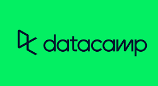

<h2 align="center" font-weight="bold">
💻 Welcome to my GitHub! 💻    I am Charbel Medlej, a Junior Software Engineer 
</h2>

<h1>🧬 About Me</h1>
Hi there! Nice to meet you 🙂

I’m a passionate Software Developer known for developing the award-winning project, Artemis. With a strong foundation in both individual achievements and collaborative efforts, I bring a rich blend of technical expertise and a relentless drive for excellence to every project. My background includes delivering innovative solutions and continuously enhancing my skill set in the ever-evolving tech landscape. Whether it’s developing robust software or engaging with cutting-edge technologies, I’m committed to fostering significant advancements and achieving superior outcomes in full-stack development. 

 
 

	

			
 

 
 

<h1>
  📚 Currently Learning
</h1>

<table align="center" style="width:100%; max-width: 800px;">
  <tr>
    <td align="center" >
      
Cyber Security

	  
      
    </td>
    <td align="center" >
      
Artificial Intelligence & Data Science

	  
      
    </td>
  </tr>
</table>

 
 

<h1 font-weight="bold">
  ⚙️ My Skills  
</h1>

<h3>👉 Programming Languages 💻 </h3>

   
 

 <h3>👉 Frontend Development 🖥 </h3>

   
 

<h3>👉 Backend Development ⚙️</h3>

   
 

 <h3>👉 Tools 🛠 </h3>

   
 

 
  <h3>👉 Others 🧰️ </h3>

   
 

